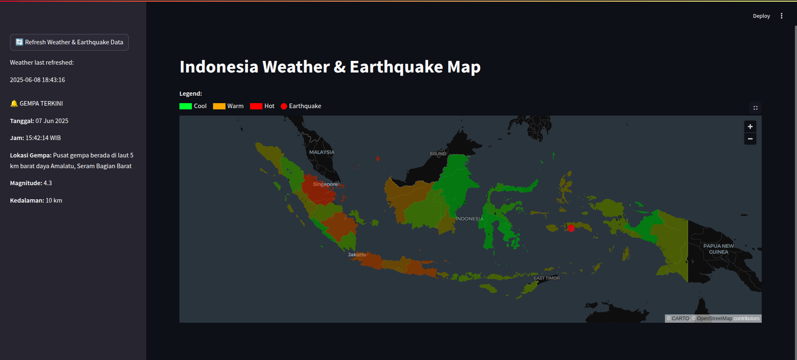

<h1 align="center">🌦️ Indonesia Weather & Earthquake Map</h1>

  A Streamlit-based interactive map visualizing weather and earthquake data across Indonesia, 
  powered by <strong>Apache Kafka</strong> and <strong>AWS DynamoDB</strong>.

<h2>📌 Features</h2>
<ul>
  <li>Displays <strong>weather data</strong> (temperature, humidity, wind, weather condition) by province</li>
  <li>Visualizes <strong>earthquake location</strong> from across Indonesia with magnitude, depth, and location</li>
  <li>Color-coded provinces by temperature (cool → warm → hot)</li>
  <li>Hover tooltips showing detailed info per province</li>
  <li>Manual data refresh via sidebar</li>
</ul>

<h2>🗺️ Map Example</h2>

  

<h2>⚙️ Technologies Used</h2>
<ul>
  <li><strong>Python</strong> with <code>Streamlit</code> for frontend UI</li>
  <li><strong>Pydeck</strong> (Deck.gl) for interactive mapping</li>
  <li><strong>AWS DynamoDB</strong> to store weather and earthquake data</li>
  <li><strong>Apache Kafka</strong> for weather & earthquake data streaming and ingestion</li>
  <li><strong>Pandas</strong> and <strong>NumPy</strong> for data wrangling</li>
  <li><strong>GeoJSON</strong> for province boundary mapping</li>
</ul>

<h2>🚀 Project Architecture</h2>

  

<em>Includes Kafka producer-consumer pipeline for weather data streaming</em>

<h2>📁 Folder Structure</h2>

<pre>
📦 indonesia-weather-map/
├── 📄 app.py               # Main Streamlit app
├── 📄 kafka_producer.py    # Kafka producer to stream weather data
├── 📄 kafka_consumer.py    # Kafka consumer to ingest and store data in DynamoDB
├── 📄 README.md            # Project documentation
├── 📄 requirements.txt     # Python dependencies
├── 📄 indonesia-province-simple.json  # GeoJSON boundaries
└── 📸 screenshot.png       # App screenshot
</pre>

<strong>Author:</strong> <a href="https://github.com/qarisp">@qarisp</a>

